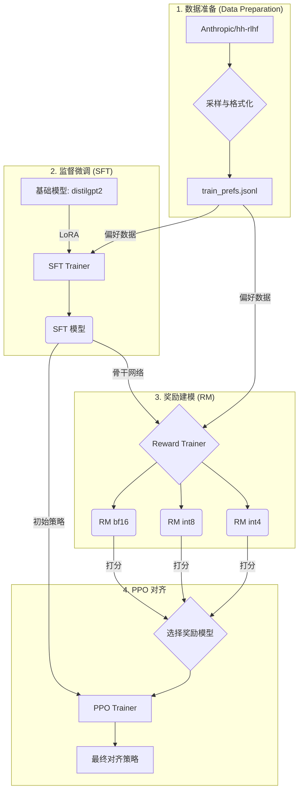

# EdgeRLHF: 在单个消费级GPU上实现全栈 RLHF

```
  _   _ _   _ ___  ___   _   __  __ ___ ___ ___ 
 | | | | \ | | _ \/ __| /_\ |  \/  | _ \ __| _ \
 | |_| |  \| |  _/\__ \/ _ \| |\/| |  _/ _||   /
  \___/|_|\_|_|  |___/_/ \_\_|  |_|_| |___|_|_\
                                               
```
**一个高性能、内存优化的全栈式"人类反馈强化学习" (RLHF) 实现，专为在单个消费级 GPU (如 RTX 4060) 上运行而设计。**

本项目证明了，尖端的 AI 对齐研究并非大型数据中心的专利。通过利用模型量化和参数高效微调 (PEFT) 等前沿技术，我们提供了一个在平民化硬件上训练和评估对齐语言模型的完整平台。

## 🎯 核心特性

-   **端到端 RLHF 管线**: 完整实现了三个关键阶段：监督微调 (SFT)、奖励建模 (RM) 和近端策略优化 (PPO)。
-   **极致的内存优化**: 专为 **8GB VRAM** 显存的 GPU 设计，综合运用了 QLoRA、`bitsandbytes` 量化和梯度检查点技术。
-   **量化感知研究**: 系统性地训练和评估在 `bf16`, `int8`, 和 `int4` 精度下的奖励模型，以分析量化对对齐质量的影响。
-   **模块化与可复现**: 通过一系列 Jupyter Notebook 进行组织，以实现清晰、分步的执行和实验。
-   **基础模型**: 使用 `distilgpt2` 作为一个轻量级但功能强大的对齐基础。

## 🛠️ 技术架构

本项目遵循一个结构化的三阶段管线来对齐基础语言模型。



1.  **监督微调 (SFT)**: 使用 LoRA 在偏好数据集上对基础 `distilgpt2` 模型进行微调，使其学习所需的对话风格。这会创建一个初始的"SFT模型"。
2.  **奖励建模 (RM)**: SFT 模型被用作骨干网络来训练三个独立的奖励模型。每个模型学习预测一个标量"奖励"分数，以表示回应的质量。我们在 `bf16`, `int8`, 和 `int4` 三种精度下训练模型，以研究性能与质量的权衡。
3.  **近端策略优化 (PPO)**: SFT 模型（现在是"策略"）使用 PPO 进行进一步训练。在每个步骤中，它都会生成一个回应，由奖励模型对其评分，然后更新策略以最大化奖励。这将模型的行为与学到的偏好对齐。

## 🚀 快速上手

本项目由一系列 Jupyter Notebook 构成。为了获得完整的体验，请按顺序运行它们。

### 1. 安装设置

克隆本仓库并安装依赖。
```bash
git clone https://github.com/PrescottClub/Tiny-HPC-RLHF-.git
cd EdgeRLHF
```
现在，启动 Jupyter Lab 并运行 `00_Setup.ipynb`。它将自动安装所有必需的库 (`torch`, `transformers`, `trl`, `peft`, `bitsandbytes`) 并创建必要的目录。

### 2. 执行流程

按顺序运行从 `01` 到 `04` 的 Notebook：

-   `01_Data_Preparation.ipynb`: 下载并处理 `Anthropic/hh-rlhf` 数据集。
-   `02_SFT_Finetuning.ipynb`: 对基础模型执行参数高效微调 (PEFT)。
-   `03_Reward_Modeling.ipynb`: 训练三个不同精度的量化奖励模型。
-   `04_PPO_Alignment.ipynb`: 使用每个奖励模型运行最终的 PPO 对齐实验。

## 📁 项目结构

```
EdgeRLHF/
├── 00_Setup.ipynb
├── 01_Data_Preparation.ipynb
├── 02_SFT_Finetuning.ipynb
├── 03_Reward_Modeling.ipynb
├── 04_PPO_Alignment.ipynb
├── README.md
├── data/
│   ├── test_prefs.jsonl
│   └── train_prefs.jsonl
├── models/
│   ├── rm/
│   │   └── bf16/
│   │       ├── adapter_config.json
│   │       └── adapter_model.safetensors
│   └── sft/
│       ├── adapter_config.json
│       └── adapter_model.safetensors
└── results/
```

## 🤝 贡献

欢迎任何形式的贡献！如果您有改进的想法、发现 bug 或希望添加新功能，请随时开启一个 issue 或提交 pull request。

## 📄 许可证

本项目采用 MIT 许可证。详情请参阅 `LICENSE` 文件。