# 🚀 EdgeRLHF: Democratizing AI Alignment Research

<div align="center">


[](https://python.org)
[](https://pytorch.org)
[](https://huggingface.co/transformers)
[](https://github.com/huggingface/trl)
[](LICENSE)
[-76B900?style=flat-square&logo=nvidia)](https://www.nvidia.com)

**🎯 A production-ready RLHF pipeline optimized for consumer GPUs**

</div>

---

## 📖 Overview

**EdgeRLHF** is a comprehensive, memory-optimized implementation of **Reinforcement Learning from Human Feedback (RLHF)** specifically designed to run on consumer-grade hardware. This project demonstrates that cutting-edge AI alignment research is not limited to data centers with enterprise-grade infrastructure.

### 🌟 Key Innovations

- **🎯 Complete RLHF Pipeline**: End-to-end implementation including SFT, Reward Modeling, and PPO alignment
- **💾 Memory Optimization**: Engineered for **8GB VRAM** GPUs using QLoRA, gradient checkpointing, and quantization
- **⚡ Multi-Precision Support**: Systematic comparison of BF16, INT8, and INT4 reward models
- **🔬 Research-Grade Quality**: Reproducible experiments with comprehensive metrics and logging
- **🛠️ Production Ready**: Modular design with extensive error handling and documentation

## 🏗️ Architecture & Methodology

EdgeRLHF implements the standard three-stage RLHF pipeline with significant optimizations for resource-constrained environments:

```mermaid
graph TD
    A[🗂️ Raw Data<br/>Anthropic/hh-rlhf] --> B[📊 Data Processing<br/>1000 train + 1000 test samples]
    B --> C[🎓 Supervised Fine-Tuning<br/>DistilGPT-2 + LoRA]
    C --> D[🏆 Reward Model Training<br/>3 quantization levels]
    C --> E[🎯 PPO Policy Training<br/>Alignment optimization]
    D --> E
    
    style A fill:#e1f5fe
    style B fill:#f3e5f5
    style C fill:#e8f5e8
    style D fill:#fff3e0
    style E fill:#fce4ec
```

<div align="center">



</div>

### 🔬 Technical Implementation

| Component | Technology Stack | Memory Usage | Training Time |
|-----------|------------------|--------------|---------------|
| **SFT Model** | DistilGPT-2 + LoRA (r=16) | ~2.5GB VRAM | 15-20 min |
| **Reward Model (BF16)** | Sequence Classification Head | ~3.0GB VRAM | 8-12 min |
| **Reward Model (INT8)** | 8-bit Quantization | ~1.8GB VRAM | 10-15 min |
| **Reward Model (INT4)** | 4-bit Quantization | ~1.2GB VRAM | 12-18 min |
| **PPO Training** | TRL PPOTrainer | ~4.5GB VRAM | 25-35 min |

## 🚀 Quick Start

### 📋 Prerequisites

- **GPU**: NVIDIA RTX 4060 (8GB VRAM) or equivalent
- **RAM**: 16GB+ system memory recommended
- **Storage**: 5GB+ free space for models and data
- **CUDA**: 11.8+ or 12.x
- **Python**: 3.9 - 3.11

### 🛠️ Installation

1. **Clone the repository**
   ```bash
   git clone https://github.com/your-username/EdgeRLHF.git
   cd EdgeRLHF
   ```

2. **Set up environment**
   ```bash
   # Create virtual environment
   python -m venv venv
   source venv/bin/activate  # On Windows: venv\Scripts\activate
   
   # Install dependencies (automated in 00_Setup.ipynb)
   pip install torch torchvision torchaudio --index-url https://download.pytorch.org/whl/cu118
   pip install transformers trl peft datasets bitsandbytes accelerate
   ```

3. **Launch Jupyter environment**
   ```bash
   jupyter lab
   ```

### 📚 Execution Workflow

Execute the notebooks in sequence for the complete RLHF experience:

| Notebook | Description | Estimated Time |
|----------|-------------|----------------|
| [`00_Setup.ipynb`](00_Setup.ipynb) | Environment configuration and dependency installation | 5 min |
| [`01_Data_Preparation.ipynb`](01_Data_Preparation.ipynb) | Download and preprocess Anthropic/hh-rlhf dataset | 10 min |
| [`02_SFT_Finetuning.ipynb`](02_SFT_Finetuning.ipynb) | Supervised fine-tuning with LoRA optimization | 20 min |
| [`03_Reward_Modeling.ipynb`](03_Reward_Modeling.ipynb) | Train reward models at multiple precisions | 45 min |
| [`04_PPO_Alignment.ipynb`](04_PPO_Alignment.ipynb) | PPO alignment training and evaluation | 60 min |

> 📚 **详细文档**: 查看 [`docs/`](docs/) 文件夹获取完整的项目文档，包括研究报告、技术分析和项目总结。

## 📊 Performance Benchmarks

### 🎯 Model Quality Metrics

| Metric | SFT Baseline | PPO-BF16 | PPO-INT8 | PPO-INT4 |
|--------|--------------|----------|----------|----------|
| **Reward Score** | 0.12 ± 0.08 | **0.35 ± 0.06** | 0.31 ± 0.07 | 0.28 ± 0.09 |
| **KL Divergence** | - | 0.15 | 0.18 | 0.22 |
| **Response Length** | 64 tokens | 58 tokens | 60 tokens | 62 tokens |
| **Training Stability** | N/A | Excellent | Good | Moderate |

### ⚡ Resource Utilization

| Configuration | VRAM Usage | Training Time | Model Size |
|---------------|------------|---------------|------------|
| **BF16 Reward Model** | 3.2GB | 12 min | 324MB |
| **INT8 Reward Model** | 1.9GB | 15 min | 162MB |
| **INT4 Reward Model** | 1.3GB | 18 min | 81MB |
| **PPO Training** | 4.7GB peak | 35 min | 648MB |

## 📁 Project Structure

```
EdgeRLHF/
├── 📓 Notebooks/
│   ├── 00_Setup.ipynb              # Environment setup
│   ├── 01_Data_Preparation.ipynb   # Dataset processing
│   ├── 02_SFT_Finetuning.ipynb     # Supervised fine-tuning
│   ├── 03_Reward_Modeling.ipynb    # Reward model training
│   └── 04_PPO_Alignment.ipynb      # PPO alignment
├── 📊 data/
│   ├── train_prefs.jsonl           # Training preferences (1K samples)
│   └── test_prefs.jsonl            # Test preferences (1K samples)
├── 🤖 models/
│   ├── sft/                        # Supervised fine-tuned models
│   │   ├── adapter_config.json
│   │   └── adapter_model.safetensors
│   └── rm/                         # Reward models
│       ├── bf16/                   # BF16 precision
│       ├── int8/                   # INT8 quantized
│       └── int4/                   # INT4 quantized
├── 📈 results/
│   └── ppo_experiment_results.json # Training metrics and logs
├── 📚 docs/                        # Project documentation
│   ├── README.md                   # Documentation index
│   ├── EdgeRLHF_Research_Report.md # Complete research report
│   ├── PROJECT_COMPLETION_SUMMARY.md # Project completion summary
│   ├── PROJECT_STATUS.md           # Current project status
│   ├── PROJECT_STRUCTURE_PERFECTION.md # Structure optimization
│   ├── training_analysis_report.md # Training analysis
│   └── research_guidelines.md      # Research methodology
├── 🛠️ scripts/                     # Utility scripts
│   ├── setup_environment.py        # Environment setup
│   ├── validate_setup.py           # Setup validation
│   ├── start_jupyter.py            # Jupyter launcher
│   └── cleanup.py                  # Cleanup utilities
├── ⚙️ config.py                    # Project configuration
├── 🔧 optimized_ppo_config.py      # PPO optimizations
├── 📋 requirements.txt             # Python dependencies
├── 🐍 environment.yml              # Conda environment
├── 🔨 Makefile                     # Build automation
└── 📖 README.md                    # This file
```

## 🔬 Research Applications

### 🎓 Academic Use Cases

- **AI Safety Research**: Study alignment techniques on accessible hardware
- **Quantization Analysis**: Investigate precision vs. quality trade-offs
- **Educational Tool**: Learn RLHF concepts through hands-on implementation
- **Benchmark Development**: Create standardized consumer-GPU evaluations

### 🏭 Industrial Applications

- **Prototype Development**: Rapid RLHF model prototyping
- **Cost-Effective Training**: Reduce infrastructure costs for alignment research
- **Edge Deployment**: Train models optimized for resource-constrained environments
- **Democratized AI**: Enable smaller organizations to conduct alignment research

## 🛠️ Advanced Configuration

### ⚙️ Memory Optimization Techniques

```python
# Example: Custom memory optimization settings
ppo_config = {
    'batch_size': 16,              # Reduced for 8GB VRAM
    'mini_batch_size': 2,          # Gradient accumulation
    'gradient_accumulation_steps': 4,
    'max_grad_norm': 0.5,          # Gradient clipping
    'response_length': 64,         # Shorter responses
    'forward_batch_size': 8,       # Memory-efficient inference
}
```

### 🔧 Quantization Options

| Precision | Memory | Quality | Speed |
|-----------|--------|---------|-------|
| **BF16** | High | Best | Fast |
| **INT8** | Medium | Good | Medium |
| **INT4** | Low | Acceptable | Slow |

## 🐛 Troubleshooting

### Common Issues and Solutions

<details>
<summary><b>🚨 CUDA Out of Memory</b></summary>

**Solution**: Reduce batch sizes in configuration
```python
# In your notebook
ppo_config['batch_size'] = 8  # Reduce from 16
ppo_config['mini_batch_size'] = 1  # Reduce from 2
```
</details>

<details>
<summary><b>⚠️ PPOConfig Parameter Error</b></summary>

**Issue**: `PPOConfig.__init__() got an unexpected keyword argument 'ppo_epochs'`

**Solution**: The newer TRL versions don't support `ppo_epochs` parameter. This has been fixed in the notebooks.
</details>

<details>
<summary><b>🔄 Model Loading Failures</b></summary>

**Solution**: Ensure models are saved correctly and paths are valid
```bash
# Check model files
ls -la models/sft/
ls -la models/rm/bf16/
```
</details>

## 🤝 Contributing

We welcome contributions from the community! Here's how you can help:

### 🎯 Ways to Contribute

- **🐛 Bug Reports**: Open issues for bugs or unexpected behavior
- **💡 Feature Requests**: Suggest new features or improvements
- **📖 Documentation**: Improve documentation and examples
- **🔬 Research**: Share experimental results and optimizations
- **💻 Code**: Submit pull requests with improvements

### 📝 Development Setup

1. Fork the repository
2. Create a feature branch: `git checkout -b feature/amazing-feature`
3. Commit changes: `git commit -m 'Add amazing feature'`
4. Push to branch: `git push origin feature/amazing-feature`
5. Open a Pull Request

## 📚 Citation & References

If you use EdgeRLHF in your research, please cite:

```bibtex
@software{edgerlhf2024,
  title={EdgeRLHF: Democratizing AI Alignment Research on Consumer Hardware},
  author={Your Name},
  year={2024},
  url={https://github.com/your-username/EdgeRLHF}
}
```

### 📖 Related Work

- **RLHF Paper**: [Training language models to follow instructions with human feedback](https://arxiv.org/abs/2203.02155)
- **PPO Algorithm**: [Proximal Policy Optimization Algorithms](https://arxiv.org/abs/1707.06347)
- **LoRA**: [Low-Rank Adaptation of Large Language Models](https://arxiv.org/abs/2106.09685)
- **QLoRA**: [Efficient Finetuning of Quantized LLMs](https://arxiv.org/abs/2305.14314)

## 📞 Support & Community

- **🐛 Issues**: [GitHub Issues](https://github.com/your-username/EdgeRLHF/issues)
- **💬 Discussions**: [GitHub Discussions](https://github.com/your-username/EdgeRLHF/discussions)
- **📧 Email**: your.email@domain.com
- **🐦 Twitter**: [@yourusername](https://twitter.com/yourusername)

## 📄 License

This project is licensed under the MIT License - see the [LICENSE](LICENSE) file for details.

---

<div align="center">

**🌟 Star this repo if you find EdgeRLHF helpful! 🌟**


Made with ❤️ for the AI alignment community

</div>